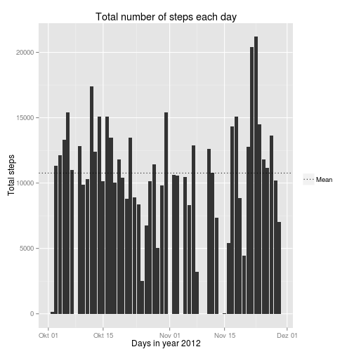
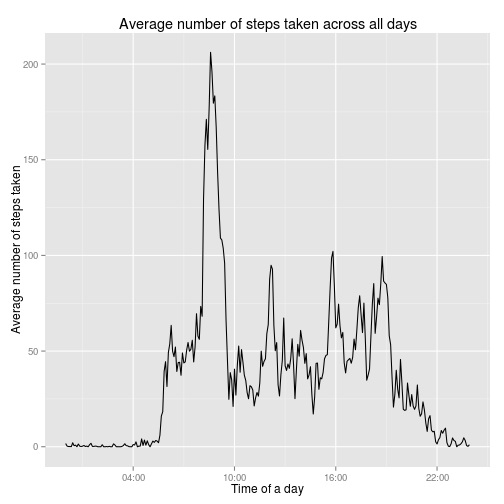
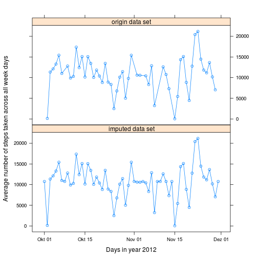
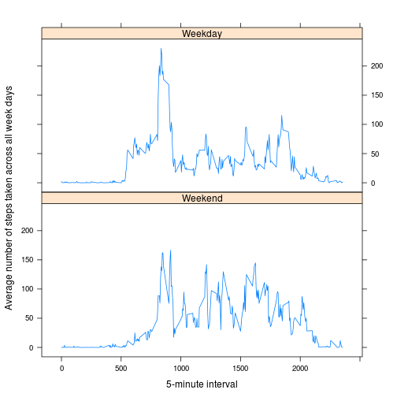

[//]: # (Reproducible Research-004)
[//]: # (Peer Assessment 1)
[//]: # (personal activity monitoring device)

Personal activity monitoring device
===================================

# Reproducible Research-004: Peer Assessment 1

> This assignment makes use of data from a personal activity monitoring device.
This device collects data at 5 minute intervals through out the day. The data
consists of two months of data from an anonymous individual collected during
the months of October and November, 2012 and include the number of steps taken
in 5 minute intervals each day.

## Loading and preprocessing the data
The data set was downloaded from the Coursera.org website from the Course
Reproducible Research-004 from the site "Peer Assessment 1".
The CSV file contains the data set which is loaded into the memory.

> The variables included in this dataset are:
* __steps__: Number of steps taking in a 5-minute interval (missing values
are coded as NA)
* __date__: The date on which the measurement was taken in YYYY-MM-DD format
* __interval__: Identifier for the 5-minute interval in which measurement was
taken
>
>The dataset is stored in a comma-separated-value (CSV) file and there are a total of 17,568 observations in this dataset.


```r
zip.filename <- "activity.zip"
csv.filename <- "activity.csv"

read.data <- function(zip.filename,csv.filename){
        if (file.exists(zip.filename)) {
                file = unz(zip.filename, csv.filename)
                } else {stop("data set ZIP-file is missing")}
        dataset <- read.csv(file)
        dataset$date <- as.Date(dataset$date,format="%Y-%m-%d")
        dataset$interval <- as.factor(dataset$interval)
        return(dataset)}

pamd <- read.data(zip.filename,csv.filename)
```


## What is mean total number of steps taken per day?

[//]: # (For this part of the assignment, you can ignore the missing values in)
[//]: # (the dataset.)
[//]: # ( )
[//]: # (1. Make a histogram of the total number of steps taken each day)
[//]: # ( )
[//]: # (2. Calculate and report the mean and median total number of steps)
[//]: # (   taken per day)

Sorting the data set and plotting a histogram with mean.


```r
tspd <- aggregate(data=pamd,steps~date,sum)
summary.tspd <- summary(tspd$steps,digits=5)
print(summary.tspd)
```

```
##    Min. 1st Qu.  Median    Mean 3rd Qu.    Max. 
##      41    8841   10765   10766   13294   21194
```

The mean is
10766
rounded up from the total number of steps each day.

A histogram will show the data set of the total number of steps taken each day.

```r
library(ggplot2)
plottingtotalstepsperday <-
        ggplot(data=tspd,aes(date,steps)) +
        geom_bar(stat="identity") +
        geom_hline(aes(linetype="Mean",
                       yintercept=as.numeric(summary(tspd$steps,digits=5)["Mean"])),
                   show_guide = TRUE) +
        scale_linetype_manual(values="dotted") +
        guides(linetype=guide_legend(label=TRUE,title="")) + 
        xlab("Days in year 2012") +
        ylab("Total steps") +
        ggtitle("Total number of steps each day")
print(plottingtotalstepsperday)
```

 


## What is the average daily activity pattern?

[//]: # (1 .Make a time series plot (i.e. type = "l"))
[//]: # (     of the 5-minute interval (x-axis) and)
[//]: # (     the average number of steps taken,)
[//]: # (       averaged across all days (y-axis))
[//]: # ( )
[//]: # (2. Which 5-minute interval, on average across all the days in the)
[//]: # (   dataset, contains the maximum number of steps?)

The 5-minute interval in relation to the average number of steps taken each day.


```r
library(plyr)
# Calculate the sum of steps for each interval across all days and
# calculate the mean of steps for each intervall across all days
acrossalldays <- ddply(pamd,.(interval),summarize,
                       totalsteps = sum(steps, na.rm=TRUE),
                       meansteps = mean(steps, na.rm=TRUE))

# Converting the factor of variable interval into POSIX time. Ggplot needs it.
acrossalldays$time <- as.numeric(as.character(acrossalldays$interval))
acrossalldays$time <- sprintf("%04d",acrossalldays$time)
acrossalldays$time <- strptime(acrossalldays$time, "%H%M")

library(scales)
# Plotting and converting time into Hours:Minutes format
ggplot(data=acrossalldays,aes(x=time,
                              y=meansteps,
                              group=1)) +
        geom_line() +
        scale_x_datetime(breaks=("6 hour"),
                         labels=date_format("%H:%M")) +
        xlab("Time of a day") +
        ylab("Average number of steps taken") +
        ggtitle("Average number of steps taken across all days")
```

 


```r
# Ordering the mean values in decreasing order and select the first one -
# the highest one.
highest <- acrossalldays[order(acrossalldays$meansteps,
                               decreasing=TRUE),
                         c("meansteps","totalsteps","interval","time")][1,]
print(highest[c("meansteps","totalsteps","interval")])
```

```
##     meansteps totalsteps interval
## 104     206.2      10927      835
```

The maximum number of steps on average across all the days in the data set is
at interval
835 or
08:35 o'clock.


## Imputing missing values

[//]: # (Note that there are a number of days/intervals where there are)
[//]: # (missing values (coded as NA). The presence of missing days may)
[//]: # (introduce bias into some calculations or summaries of the data.)
[//]: # ( )
[//]: # (    1. Calculate and report the total number of missing values in the)
[//]: # (       dataset (i.e. the total number of rows with NAs))
[//]: # ( )
[//]: # (    2. Devise a strategy for filling in all of the missing values in)
[//]: # (       the dataset. The strategy does not need to be sophisticated.)
[//]: # (       For example, you could use the mean/median for that day, or)
[//]: # (       the mean for that 5-minute interval, etc.)
[//]: # ( )
[//]: # (    3. Create a new dataset that is equal to the original dataset but)
[//]: # (       with the missing data filled in.)
[//]: # ( )
[//]: # (    4. Make a histogram of the total number of steps taken each day)
[//]: # (       and Calculate and report the mean and median total number of)
[//]: # (       steps taken per day. Do these values differ from the estimates)
[//]: # (       from the first part of the assignment? What is the impact of)
[//]: # (       imputing missing data on the estimates of the total daily)
[//]: # (       number of steps?)


> The presence of missing days may introduce bias into some calculations or
summaries of the data.

What is the total number of missing values in the data set in rows from each
column of the data set?


```r
# preperation for creating a list
totalnas <- NULL
totalnas$steps <- sum(as.numeric(is.na(pamd$steps)))
totalnas$date <- sum(as.numeric(is.na(pamd$date)))
totalnas$interval <- sum(as.numeric(is.na(pamd$interval)))

print(as.data.frame(totalnas))
```

```
##   steps date interval
## 1  2304    0        0
```

There are 2304 missing rows in column
steps.


The __strategy__ for filling in all of the missing values in the dataset:
A missing value in the steps column will be replaced by the mean across all
days for that corresponding 5-minute interval.


```r
library(plyr)
# Originally written by Brian Zive
# technique to replace NA with mean by subset in R and the impute.mean function 
# described at http://stackoverflow.com/a/9322975/3657371
mean.imputed <- function(x) replace(x, is.na(x), mean(x, na.rm = TRUE))

# create a new dataset that is equal to the original dataset, but with the 
# missing data filled in original dataset is first three variables of
# the [pamd] dataframe (Brian Zive)
pamd.imputed <- ddply(pamd[1:3], .(interval), transform,
                      steps = mean.imputed(steps),
                      date = date,
                      interval = interval)

# sort by date and interval (Brian Zive)
pamd.imputed <- pamd.imputed[order(pamd.imputed$date,
                                   pamd.imputed$interval),]

# renumber rownames (Brian Zive)
row.names(pamd.imputed) <- 1:nrow(pamd.imputed)
```


What is mean total number of steps taken per day from the imputed data set?

```r
imputed.tspd <- aggregate(data=pamd.imputed,steps~date,sum)
summary.imputed.tspd <- summary(imputed.tspd$steps,digits=5)
print(summary.imputed.tspd)
```

```
##    Min. 1st Qu.  Median    Mean 3rd Qu.    Max. 
##      41    9819   10766   10766   12811   21194
```
The mean is
10766
rounded up from the total number of steps each day.

What is the difference of mean and median of the origin data set and the
imputed data set in absolute values?

```r
difference.tspd <- abs(summary.tspd - summary.imputed.tspd)
difference.tspd[c("Median","Mean")]
```

```
## Median   Mean 
##      1      0
```


Two line plots in comparision will shown the origin data set and the imputed
data set. The origin data set with NA values and the imputed data set with
replaced NA values with a mean value specified above as strategy.


```r
imputed.tspd$dataset <- c("imputed data set")
tspd$dataset <- c("origin data set")
overall.tspd <- rbind(tspd,
                      imputed.tspd)
overall.tspd$dataset <- as.factor(
        overall.tspd$dataset)

library(lattice)
plot.overall.tspd <- xyplot(steps~date|dataset,
                            data=overall.tspd,
                            layout=c(1,2),
                            type = "b",
                            xlab ="Days in year 2012",
                            ylab ="Average number of steps taken across all week days")
print(plot.overall.tspd)
```

 

I conclude there is no difference between the origin data set with NA values
and the imputed data set with a mean value from the corresponding days, because
the mean value is zero and the median slighly changed to 1 which is nearly one 
thousandth (``9.28936367858802e-05``) to the origin data set.


## Are there differences in activity patterns between weekdays and weekends?

[//]: # (For this part the weekdays() function may be of some help here. Use)
[//]: # (the dataset with the filled-in missing values for this part.)
[//]: # ( )
[//]: # (    1. Create a new factor variable in the dataset with two levels –)
[//]: # (       “weekday” and “weekend” indicating whether a given date is a)
[//]: # (       weekday or weekend day.)
[//]: # ( )
[//]: # (    2. Make a panel plot containing a time series plot)
[//]: # (       (i.e. type = "l") of the 5-minute interval (x-axis) and the)
[//]: # (       average number of steps taken, averaged across all weekday)
[//]: # (       days or weekend days (y-axis). The plot should look something)
[//]: # (       like the following, which was creating using simulated data:)

The patterns will be calculated with the imputed data set.


```r
# Changing the localization to get returns from function weekdays
# in english language.
Sys.setlocale(category = "LC_TIME", locale = "C")
```


```r
# select all weekdays with the complementary of the weekend days
pamd.imputed <- cbind(pamd.imputed,
                      weekday=!(weekdays(pamd.imputed$date) %in%
                                        c("Saturday","Sunday")))

# Boolean/Logic: 1/TRUE for weekdays and 0/FALSE for weekend which were
# produced by function weekdays
pamd.imputed$weekday <- as.factor(as.numeric(pamd.imputed$weekday))
# levels are ascending sorted
levels(pamd.imputed$weekday) <- c("Weekend","Weekday")

library(plyr)
# Calculate the sum of steps for each interval across all weekday days
weekday.days <- ddply(pamd.imputed[pamd.imputed$weekday == "Weekday",],
                      .(interval,weekday),
                      summarize,
                      totalsteps = sum(steps, na.rm=TRUE),
                      meansteps = mean(steps, na.rm=TRUE))

# Calculate the mean of steps for each intervall across weekend days
weekend.days <- ddply(pamd.imputed[pamd.imputed$weekday == "Weekend",],
                      .(interval,weekday),
                      summarize,
                      totalsteps = sum(steps, na.rm=TRUE),
                      meansteps = mean(steps, na.rm=TRUE))

# Preparing the plot with one whole data set which will be differentiable with
# a factor variable
all.weekdays <- rbind(weekday.days,weekend.days)
# Preparing the plot with factor variables created above and a numeric x-axis
# to avoid an overlapping of letterings
all.weekdays$time <- as.numeric(as.character(all.weekdays$interval))

# Creating the plot to compare two data sets differentiable with the factor 
# variable weekday
library(lattice)
plot.all.weekdays <- xyplot(meansteps~time|weekday,
                            data=all.weekdays,
                            layout=c(1,2),
                            type = "l",
                            xlab ="5-minute interval",
                            ylab ="Average number of steps taken across all week days")
print(plot.all.weekdays)
```

 

```r
# Changing the localization back in origin sate.
Sys.setlocale(locale = "") 
```


